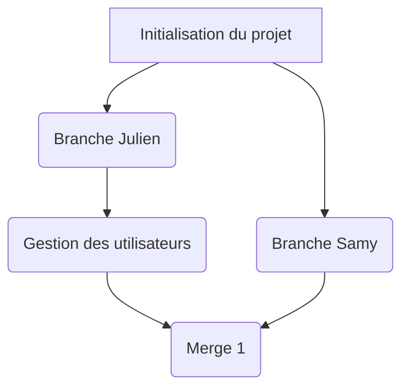

# memoryApp

## Déploiement
### local
```bash
npm i
```
```bash
npm run dev
```
### Mise en prod
Si on est CHAUD

<hr>


## Authentification des utilisateurs
### Gestion du store

<hr>

## Gestion des catégories

<hr>

## Création de cartes
### Recto-verso
Question - réponse pour chaque carte

<hr>

## Création de listes - thèmes

<hr>

## Partage et import de listes

<hr>

## Préparer la OU les liste/s
* Choix du nombre de cartes ajoutées / jour
* Choix du nombre de niveaux

<hr>

## Faire les cartes du jour des différentes listes

<hr>

## PWA
### Service Worker
Fonctionnable hors ligne
### Manifest
### Notification push
Mettre en place un rappel quotidien


<hr>

## Techno
* VueJS 3
* Store pinia
* vue-router

<hr>

## Architecture

## Suivi de projet


