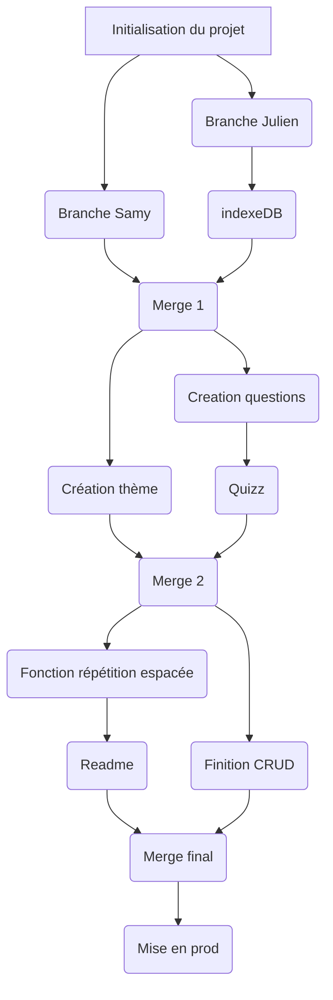

# memoryApp

## Déploiement

### local

```bash
npm i
```

```bash
npm run dev
```

### Mise en prod
Hebergement chez Alwaysdata, http://frontynovb3.alwaysdata.net/

<hr>

## Authentification des utilisateurs

### Gestion du store
Store Pinia, un fichier avec toute notre logique dans quizStore.js
<hr>

## Gestion des catégories
Une question appartient à une catégorie - C'est un choix de notre part
<hr>

## Création de cartes

### Recto-verso

Question - réponse pour chaque carte
OK
<hr>

## Création de listes - thèmes
Non implémenté mais en cours
<hr>

## Partage et import de listes
Non implémenté
<hr>

## Préparer la OU les liste/s
* Choix du nombre de cartes ajoutées / jour  
    Non implémenté
* Choix du nombre de niveaux  
    Non implémenté
<hr>

## Répétition espacée
On part du principe que la somme des puissances de 2 vaut 2^(n+1)-1  
Sn = 2^0 + 2^1 + 2^2 + ... + 2^n-1 + 2^n  
2Sn = 2^1 + 2^2 + 2^3 + ... + 2^n + 2^n+1  
2Sn - Sn = 2^n+1 - (2^n-2^n) - (2^n-1-2^n-1) - ... - (2^1-2^1) - 2^0 = Sn  
Sn = 2^(n+1)-2^0 = 2^(n+1)-1  

Donc, notre fonction qui créer le tableau de répétition espacée rempli un tableau suivant cette formule.
ou n = le nombre de niveau

Pour passer de la durée au nombre de niveau, on cherche n le plus grand possible où 2^n <= nbJours  
La fonction rempli donc un tableau de tableau, avec les puissances de 2 successives.

Malheureusement la fonction n'est pas intégrée, mais elle est fonctionnelle.

Il y a cependant la v1 de la répétition (celle du site), mais non dynamique, on calcule l'écart entre la date de réponse à la question réussie et la prochaine fois que la question doit être reposée.  
 Si la réponse à la question est fausse, retour au niveau 1.

<hr>

## PWA
### Service Worker
Fonctionnable hors ligne
### Manifest
Présent, classique et permettant l'installation de l'application
### Notification push
En cours avec Firebase pour le serveur d'envoie de notifications

<hr>

## Techno en plus
* firebase
* indexedb fonctionnel mais non implémenté (dans db.js)

<hr>

## Suivi de projet


## Reste à faire 
* Playlist
* Partage des playlists
* Vue pour commencer un thème (nb de jours + nouvelles cartes chaque jour)
* Notification push quotidienne
